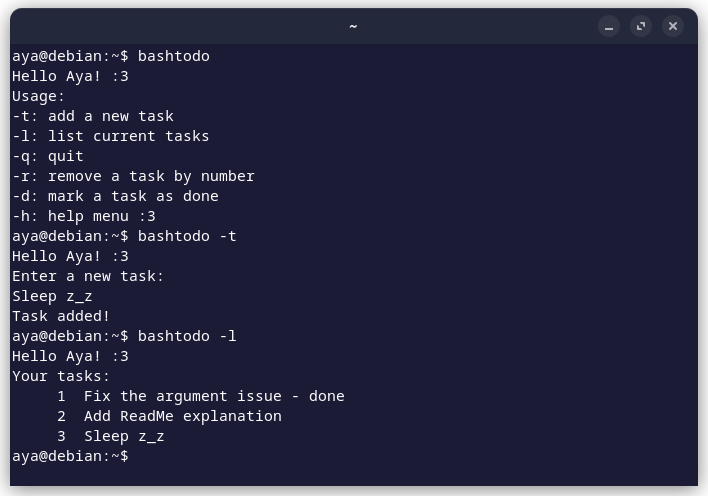

# bashtodo - CLI to-do app 📝

A simple command-line to-do list app built using **Bash** scripting. Manage your tasks directly from the terminal with simple commands like **add**, **list**, **remove**, and **mark as done**!



## Features 
- Add tasks to your to-do list
- View all the tasks in your to-do list
- Mark tasks as completed
- Remove tasks from your list
- Simple and fast command-line interface

## Installation

### Prerequisites

- **Bash** (most Linux and macOS systems come with Bash by default)
- A terminal or command-line interface

### Steps to Install

1. **Clone the repository** to your local machine:
    
    ```bash
    git clone https://github.com/ayahbash/bashtodo.git
    cd bashtodo
    ```
    
2. **Make the script executable**:
    
    ```bash
    chmod +x todo.sh
    ```
    
3. **Move the script to a directory in your PATH** (optional, but recommended for global use):

    ```bash
    sudo mv todo.sh /usr/local/bin/todo
    ```
    This allows you to run `todo` from anywhere in your terminal!
    

---

## Usage
### Available Commands

- **`todo -t`**: Add a new task
- **`todo -l`**: List all current tasks
- **`todo -r`**: Remove a task by its number
- **`todo -d`**: Mark a task as done
- **`todo -h`**: Show the help menu

## Notes

Feel free to fork this repository and create your own versions, or submit issues and pull requests if you want to improve or fix something!