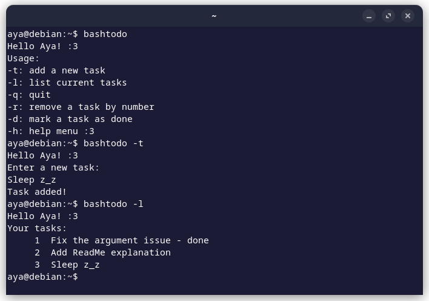

# bashtodo 📝

A simple CLI to-do list app in **Bash**.
### Usage 
- **`bashtodo -t`**: Add a new task
- **`bashtodo -l`**: List all current tasks
- **`bashtodo -r`**: Remove a task by its number
- **`bashtodo -d`**: Mark a task as done
- **`bashtodo -h`**: Show the help menu

